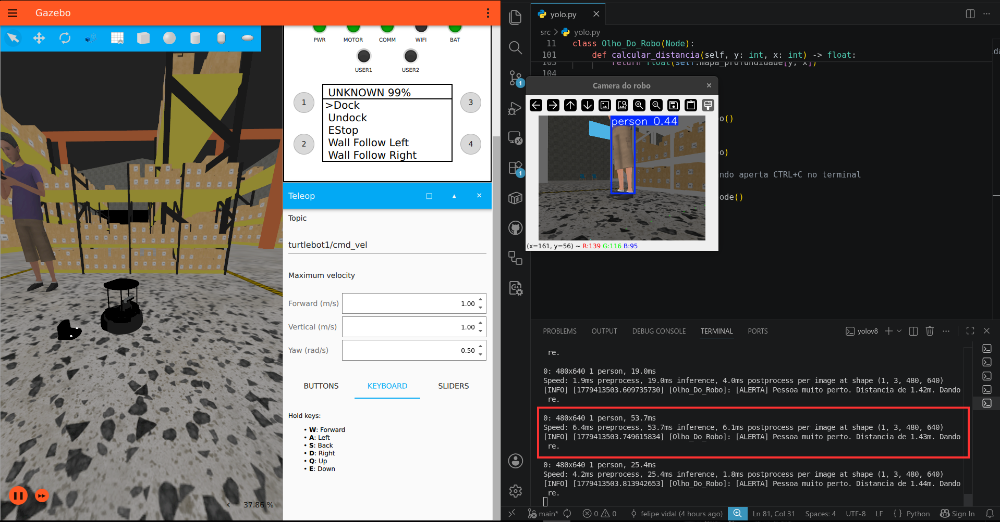

# Turtlebot4 (Pequi Mecânico)

---

## Config para GPU NVIDIA

Adicionar chave do repositório da NVIDIA
```bash
curl -fsSL https://nvidia.github.io/libnvidia-container/gpgkey | sudo gpg --dearmor -o /usr/share/keyrings/nvidia-container-toolkit-keyring.gpg \
  && curl -s -L https://nvidia.github.io/libnvidia-container/stable/deb/nvidia-container-toolkit.list | \
    sed 's#deb https://#deb [signed-by=/usr/share/keyrings/nvidia-container-toolkit-keyring.gpg] https://#g' | \
    sudo tee /etc/apt/sources.list.d/nvidia-container-toolkit.list
```

Instalar Toolkit (caso falte algo)
```bash
sudo apt-get update
sudo apt-get install -y nvidia-container-toolkit
```

Configurar o Docker para usar a runtime da NVIDIA
```bash
sudo nvidia-ctk runtime configure --runtime=docker
```
Gerar o arquivo CDI
```bash
sudo nvidia-ctk cdi generate --output=/etc/cdi/nvidia.yaml
```

Reiniciar o Docker
```bash
sudo systemctl restart docker
```

---

## Como rodar

### Dar permissão para uso de interface gráfica (necessário para usar o Gazebo)
```bash
xhost +local:docker
```

### Buildar container
```bash
docker build -t tb4_simulador .
```

### Rodar container
```bash
docker run --rm -it \
  --gpus all \
  --name tb4_simulador \
  --env="DISPLAY=$DISPLAY" \
  --env="QT_X11_NO_MITSHM=1" \
  --volume="/tmp/.X11-unix:/tmp/.X11-unix:rw" \
  --volume="$(pwd):/home/dockeruser/ws" \
  --network=host \
  tb4_simulador
```

### Em qualquer terminal: ver os tópicos do ROS2 (como o da câmera e o de velocidade).
- Usado para visualizar a câmera e enviar comandos de movimento via YOLOv8, no arquivo "yolo.py"
```bash
ros2 topic list
```

### Terminal 1: Turtlebot4 no Gazebo no mapa Warehouse
- Gazebo é um simulador 3D. Com o Turtlebot4: simula câmera, física, movimento e sensor LiDAR do robô.
- Abre no mapa Warehouse (Armazém).
- Alterar namespace para "turtlebot1". Alterar Topic em Teleop: "/cmd_vel" -> "turtlebot1/cmd_vel".
```bash
ros2 launch turtlebot4_ignition_bringup turtlebot4_ignition.launch.py world:=warehouse namespace:=turtlebot1
```

### Terminal 2: SLAM
- Simultaneous Localization and Mapping. Usa o LiDAR para poder mapear o ambiente (criar as linhas de paredes) e localizar o robô no mapa.
- "sync:=true" permite a sincronização em tempo real do Gazebo com o SLAM, para mapear a simulação
```bash
docker exec -it tb4_simulador bash
ros2 launch turtlebot4_navigation slam.launch.py sync:=true namespace:=turtlebot1
```

### Terminal 3: Nav2
- Usa o mapa gerado pelo SLAM para criar áreas de segurança, chamadas de Áreas de Custo (Costmaps).
- Essas áreas, de cores roxa e azul, criam uma camada de segurança pro robô. O robô não consegue ultrapassar a área roxa e chegar na azul, para evitar colisões.
- Calcula o trajeto ideal para o robô chegar em um certo ponto específico, além de evitar objetos estáticos e dinâmicos.
- "params_file:=/home..." permite o uso do arquivo de configuração do Nav2, que teve as distancias de alcance e desenho do LiDAR alteradas para poder identificar/apagar objetos de modo mais eficiente
```bash
docker exec -it tb4_simulador bash
ros2 launch turtlebot4_navigation nav2.launch.py namespace:=turtlebot1 params_file:=/home/dockeruser/ws/src/nav2.yaml
```

### Terminal 4: RViz2
- Alteração no Fixed Frame: "map" -> "turtlebot1/map"
- Interface visual para o SLAM e o Nav2. Permite visualizar a hitbox do robô, as linhas de parede, Costmaps e mandar comandos de movimento/direção pro robô.
- Possibilidade de ver o robô recalculando a rota ao encontar um elemento/objeto no meio da sua trajetória, para evitar colidir com esse objeto/elemento.
```bash
docker exec -it tb4_simulador bash
ros2 launch turtlebot4_viz view_robot.launch.py namespace:=turtlebot1
```

### Terminal 5: YOLOv8
- Modelo de IA que permite o robô usar sua camera para detectar elementos específicos, como pessoas, cadeiras, veículos.
- Método ouvinte (subscriber): recebe informações do Gazebo via câmera do robô e converte em dados para a IA, podendo classificar elementos e calcular a coordenada (x,y) do centro de massa desse elemento.
- Método falante (publisher): envia comandos de movimento para o robô baseado nos dados/elementos detectados pelo método ouvinte.
- Nessa simulação: ouvinte detecta pessoa -> calcula distancia da pessoa até o robô -> distancia <= 1,5m ? falante manda o robô andar para trás para evitar uma possível colisão -> para o robô quando chegar na distância mínima de 1,5m.
```bash
docker exec -it tb4_simulador bash
```
- Acessando o arquivo .py através do volume mapeado em "ws"
```bash
python3 ws/src/yolo.py
```

---

## Imagens da simulação

### Simulação no Gazebo com mapeamento SLAM e NAV2 no RVIZ2 com visão da câmera no YOLOv8


### Simulação no Gazebo com detecção de pessoa via câmera do robô no YOLOv8. Robô executa função de recuar ao chegar muito próximo da pessoa.


### Simulação no Gazebo com rota em linha reta calculada pelo NAV2


### Simulação no Gazebo com rota recalculada contornando obstáculo cúbico pelo NAV2
