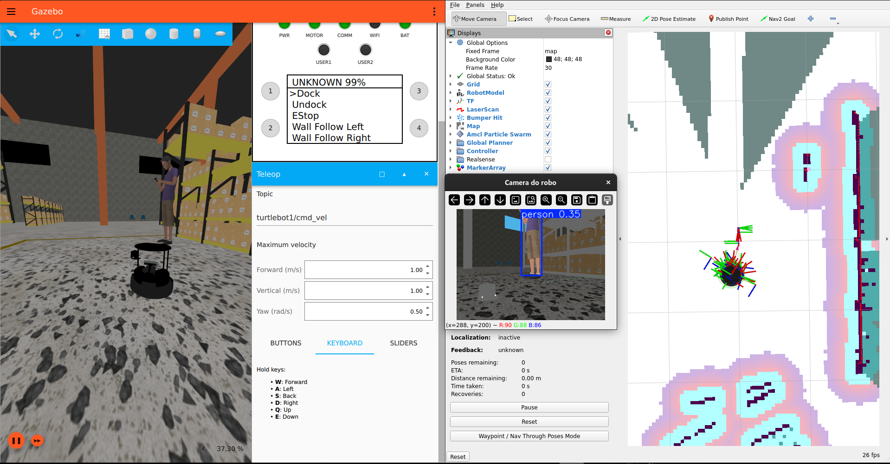
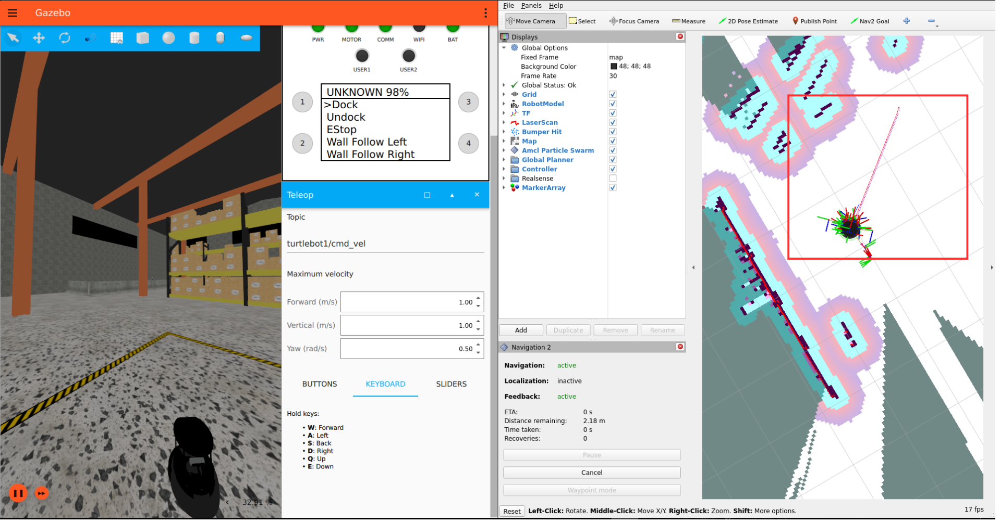
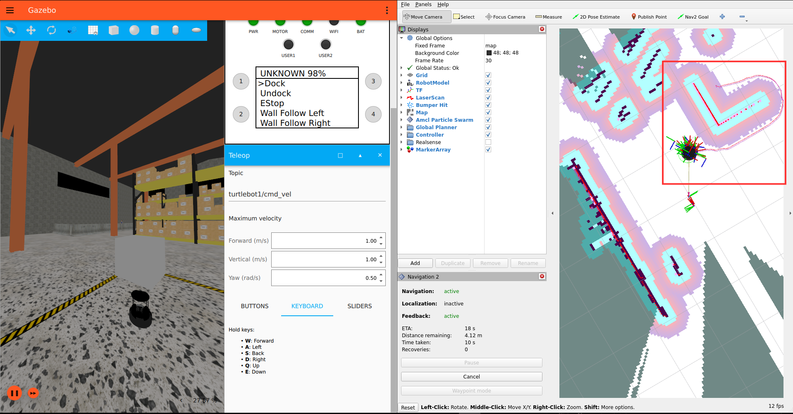

# TurtleBot4 - Software

Ambiente de simulação e navegação autônoma utilizando ROS2 Humble, Nav2, SLAM e YOLOv8n.

---

## Estrutura

- `yolo.py` → visão computacional, lógica de segurança e docking
- `nav2.yaml` → parâmetros do Nav2 e LiDAR
- `twist_mux.yaml` → prioridade de comandos de movimentação

---

# Como rodar

## 1. Clonar o repositório

```bash
git clone https://github.com/vvvvvdal/turtlebot4-pequi.git
```

## 2. Entrar no diretório de Software

```bash
cd turtlebot4-pequi/Software/
```

---

## 3. Configuração NVIDIA

### Adicionar chave do repositório NVIDIA

```bash
curl -fsSL https://nvidia.github.io/libnvidia-container/gpgkey | sudo gpg --dearmor -o /usr/share/keyrings/nvidia-container-toolkit-keyring.gpg \
  && curl -s -L https://nvidia.github.io/libnvidia-container/stable/deb/nvidia-container-toolkit.list | \
    sed 's#deb https://#deb [signed-by=/usr/share/keyrings/nvidia-container-toolkit-keyring.gpg] https://#g' | \
    sudo tee /etc/apt/sources.list.d/nvidia-container-toolkit.list
```

### Instalar NVIDIA Container Toolkit

```bash
sudo apt-get update
sudo apt-get install -y nvidia-container-toolkit
```

### Configurar runtime NVIDIA no Docker

```bash
sudo nvidia-ctk runtime configure --runtime=docker
```

### Gerar arquivo CDI

```bash
sudo nvidia-ctk cdi generate --output=/etc/cdi/nvidia.yaml
```

### Reiniciar Docker

```bash
sudo systemctl restart docker
```

---

## 4. Permitir interface gráfica

Necessário para executar o Gazebo.

```bash
xhost +local:docker
```

---

## 5. Buildar container

```bash
docker build -t tb4_simulador .
```

---

## 6. Rodar container

```bash
docker run --rm -it \
  --gpus all \
  --name tb4_simulador \
  --env="DISPLAY=$DISPLAY" \
  --env="QT_X11_NO_MITSHM=1" \
  --volume="/tmp/.X11-unix:/tmp/.X11-unix:rw" \
  --volume="$(pwd):/home/dockeruser/ws" \
  --network=host \
  tb4_simulador
```

---

# Fluxo de Execução

## Terminal 1 — Gazebo

Inicializa o TurtleBot4 no ambiente Warehouse.

```bash
ros2 launch turtlebot4_ignition_bringup turtlebot4_ignition.launch.py world:=warehouse namespace:=turtlebot1
```

---

## Terminal 2 — SLAM

Inicializa o sistema de mapeamento e localização.

```bash
docker exec -it tb4_simulador bash

ros2 launch turtlebot4_navigation slam.launch.py sync:=true namespace:=turtlebot1
```

---

## Terminal 3 — Nav2

Inicializa o sistema de navegação autônoma.

```bash
docker exec -it tb4_simulador bash

ros2 launch turtlebot4_navigation nav2.launch.py \
namespace:=turtlebot1 \
params_file:=/home/dockeruser/ws/src/nav2.yaml \
cmd_vel:=cmd_vel_nav
```

---

## Terminal 4 — RViz2

Interface gráfica para visualização do mapa, sensores e envio de metas.

Fixed Frame:
```text
turtlebot1/map
```

```bash
docker exec -it tb4_simulador bash

ros2 launch turtlebot4_viz view_robot.launch.py namespace:=turtlebot1
```

---

## Terminal 5 — YOLOv8 e Controle Autônomo

- Nó principal responsável por visão computacional, protocolos de segurança e controle autônomo.
- Detecta objetos utilizando YOLOv8n e calcula distância usando mapa de profundidade.
- Executa protocolo de segurança ao detectar pessoas próximas.
- Monitora o nível de bateria e executa retorno automático ao dock em bateria baixa.
- Permite envio de coordenadas pelo terminal via `coordenada(X,Y)`.

```bash
docker exec -it tb4_simulador bash
```

```bash
python3 ws/src/yolo.py
```

---

## Terminal 6 — twist_mux

Define prioridade dos comandos de movimentação entre Nav2 e protocolos de segurança.

```bash
docker exec -it tb4_simulador bash

ros2 run twist_mux twist_mux \
--ros-args \
--params-file /home/dockeruser/ws/src/twist_mux.yaml \
-r cmd_vel_out:=/turtlebot1/cmd_vel
```

---

# ROS2 Topics

Visualizar tópicos ROS2 ativos:

```bash
ros2 topic list
```

---

# Demonstrações

## Gazebo + RViz2 + YOLOv8



---

## Detecção de pessoa e protocolo de segurança


---

## Planejamento de rota com Nav2



---

## Replanejamento de rota com desvio de obstáculo

